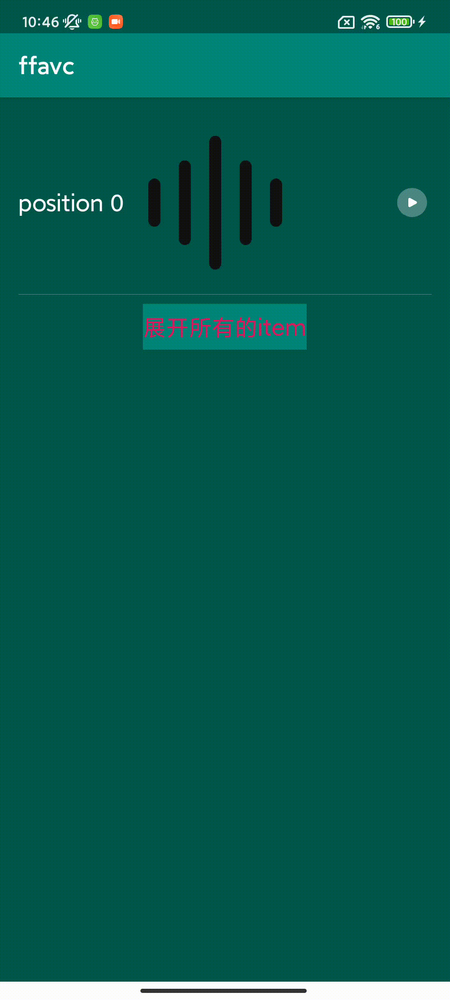

有问题的版本：`com.tencent.tav:libpag:4.0.5.11`。低于这个版本都有问题。我们项目中的版本是 `com.tencent.tav:libpag:4.0.5.10`。


### 问题复现操作步骤

### 第一个问题

1. RecyclerView 中先加载一个数据。 然后通过点击按钮播放PAGView动画。
2. 然后通过点击 `展开所有的item`，调用 notifyDataSetChanged 展开全部两条数据。 第一条数据的ViewHolder会被复用。
3. 发现第一个数据中的 PAGView 动画无法停止了。
4. 即使再次通过点击按钮播放第一个数据中的PAGView动画。依然无法执行。



### 第二个问题

1. RecyclerView 中先加载一个数据。
2. 然后通过点击 `展开所有的item`，调用 notifyDataSetChanged 展开全部两条数据。 第一条数据的ViewHolder会被复用。
3. 第一个数据中通过点击按钮播放PAGView动画，发现动画无法执行。


没有问题的版本：版本号大于等于 `com.tencent.tav:libpag:4.0.5.17` 的版本。

### 原因分析

### 根本原因

对比了两个版本 PAGView
 
* com.tencent.tav:libpag:4.0.5.11` 版本有问题的 PAGView 部分代码。
 
 
 ```java
 @Override
 public boolean onSurfaceTextureDestroyed(SurfaceTexture surface) {
     pagPlayer.setSurface(null);
     if(mListener != null) {
         mListener.onSurfaceTextureDestroyed(surface);
     }
     if(pagSurface != null) {
         pagSurface.freeCache();
     }
     //注释1处
     animator.removeUpdateListener(mAnimatorUpdateListener);
     boolean surfaceDestroy = true;
     if(g_PAGViewHandler != null && surface != null) {
         SendMessage(MSG_SURFACE_DESTROY, surface);
         surfaceDestroy = false;
     }
     if(Build.VERSION.SDK_INT >= ANDROID_SDK_VERSION_O) {
         synchronized(g_HandlerLock) {
             DestroyHandlerThread();
         }
     }
     return surfaceDestroy;
 }
 ```
 
注释1处，移除了 mAnimatorUpdateListener。 这个一个监听属性动画进度更新的回调。而PAGView正是通过这个监听回调来监听属性动画的进度更新并执行PAGView的动画的。所以移除了就会有问题。
 
```java
private final ValueAnimator.AnimatorUpdateListener mAnimatorUpdateListener = new ValueAnimator.AnimatorUpdateListener() {
    @Override
    public void onAnimationUpdate(ValueAnimator animation) {
        PAGView.this.currentPlayTime = animation.getCurrentPlayTime();
        NeedsUpdateView(PAGView.this);
    }
};
```
 
 
* `com.tencent.tav:libpag:4.0.5.17`版本没问题的 PAGView 部分代码
 
 ```java
public boolean onSurfaceTextureDestroyed(SurfaceTexture surface) {
    this.pagPlayer.setSurface((PAGSurface)null);
    if (this.mListener != null) {
        this.mListener.onSurfaceTextureDestroyed(surface);
    }

    if (this.pagSurface != null) {
        this.pagSurface.freeCache();
    }

    boolean surfaceDestroy = true;
    if (g_PAGViewHandler != null && surface != null) {
        SendMessage(1, surface);
        surfaceDestroy = false;
    }

    if (VERSION.SDK_INT >= 26) {
        synchronized(g_HandlerLock) {
            DestroyHandlerThread();
        }
    }

    return surfaceDestroy;
}
```

```java
protected void finalize() throws Throwable {
    super.finalize();
    this.animator.removeUpdateListener(this.mAnimatorUpdateListener);
}
```

没有问题的 PAGView 是在 View 真正被回收的时候才移除了 mAnimatorUpdateListener。


### 第一个问题出现的具体原因

1. RecyclerView 中先加载一个数据。 然后通过点击按钮播放PAGView动画。
2. 然后通过点击 `展开所有的item`，调用 notifyDataSetChanged 展开全部两条数据。 第一条数据的ViewHolder会被复用。
3. 发现第一个数据中的 PAGView 动画无法停止了。
4. 即使再次通过点击按钮播放第一个数据中的PAGView动画。依然无法执行。

当我们调用 notifyDataSetChanged 展开所有数据的时候，第一条数据的 View 会先 detachedFromWindow，会调用 PAGView 的 onDetachedFromWindow 方法。

```java
protected void onDetachedFromWindow() {
    this.isAttachedToWindow = false;
    super.onDetachedFromWindow();
    if(this.pagSurface != null) {
        this.pagSurface.release();
        this.pagSurface = null;
    }
    //注释1处
    this.pauseAnimator();
    if(VERSION.SDK_INT < 26) {
        synchronized(g_HandlerLock) {
            DestroyHandlerThread();
        }
    }
    //...
}
```

注释1处，把属性动画暂停了。并且 onDetachedFromWindow 会导致 PAGView 的 Surface 被销毁。 回调 onSurfaceTextureDestroyed 方法。

```java
@Override
public boolean onSurfaceTextureDestroyed(SurfaceTexture surface) {
    pagPlayer.setSurface(null);
    if(mListener != null) {
        mListener.onSurfaceTextureDestroyed(surface);
    }
    if(pagSurface != null) {
        pagSurface.freeCache();
    }
    //注释1处
    animator.removeUpdateListener(mAnimatorUpdateListener);
    boolean surfaceDestroy = true;
    if(g_PAGViewHandler != null && surface != null) {
        SendMessage(MSG_SURFACE_DESTROY, surface);
        surfaceDestroy = false;
    }
    if(Build.VERSION.SDK_INT >= ANDROID_SDK_VERSION_O) {
        synchronized(g_HandlerLock) {
            DestroyHandlerThread();
        }
    }
    return surfaceDestroy;
}
```

当被复用的View重新 onAttachedToWindow 的时候

```java
protected void onAttachedToWindow() {
    this.isAttachedToWindow = true;
    super.onAttachedToWindow();
    this.animator.addListener(this.mAnimatorListenerAdapter);
    synchronized(g_HandlerLock) {
        StartHandlerThread();
    }
    //注释1处
    this.resumeAnimator();
}
```

注释1处，会调用 resumeAnimator 方法。 

```java
private void resumeAnimator() {
    if(this._isPlaying && !this.animator.isRunning() && (this._isAnimatorPreRunning == null || this._isAnimatorPreRunning)) {
        this._isAnimatorPreRunning = null;
        //注释1处
        this.doPlay();
    } else {
        this._isAnimatorPreRunning = null;
        this.updateTextureView();
    }
}
```

会走到注释1处。

```java
public void play() {
    this._isPlaying = true;
    this._isAnimatorPreRunning = null;
    if((double) this.animator.getAnimatedFraction() == 1.0 D) {
        this.setProgress(0.0 D);
    }
    //调用 doPlay 方法。
    this.doPlay();
}
```

```java
private void doPlay() {
    this.pagPlayer.prepare();
    if(!this.isAttachedToWindow) {
        Log.e("PAGView", "doPlay: PAGView is not attached to window");
    } else {
        Log.i("PAGView", "doPlay");
        this.animator.setCurrentPlayTime(this.currentPlayTime);
        //注释1处，启动属性动画
        this.startAnimator();
    }
}
```
注释1处，启动属性动画 

```java
//属性动画
private ValueAnimator animator;

private void startAnimator() {
    if(this.isMainThread()) {
        this.animator.start();
    } else {
        this.removeCallbacks(this.mAnimatorCancelRunnable);
        this.post(this.mAnimatorStartRunnable);
    }
}
```

在复用的View重新 onAttachedToWindow 的时候，会再次启动 属性动画。但是由于在 onSurfaceTextureDestroyed 中移除了 mAnimatorUpdateListener 。
并且后续再启动动画等操作都没有重新添加 mAnimatorUpdateListener 监听属性动画。所以PAGView 动画就执行不了了。


### 第二个问题出现的具体原因

1. RecyclerView 中先加载一个数据。
2. 然后通过点击 `展开所有的item`，调用 notifyDataSetChanged 展开全部两条数据。 第一条数据的ViewHolder会被复用。
3. 第一个数据中通过点击按钮播放PAGView动画，发现动画无法执行。

也是类似的。当在View复用以后通过点击按钮播放PAGView动画，但是由于在 onSurfaceTextureDestroyed 中移除了 mAnimatorUpdateListener 。并且后续再启动动画等操作都没有重新添加 mAnimatorUpdateListener 监听属性动画。所以PAGView 动画就执行不了了。


 
 
